# Project-18 Shopify Clone

 

## Project live link
[Project-18](# "Not yet")

## Screenshot
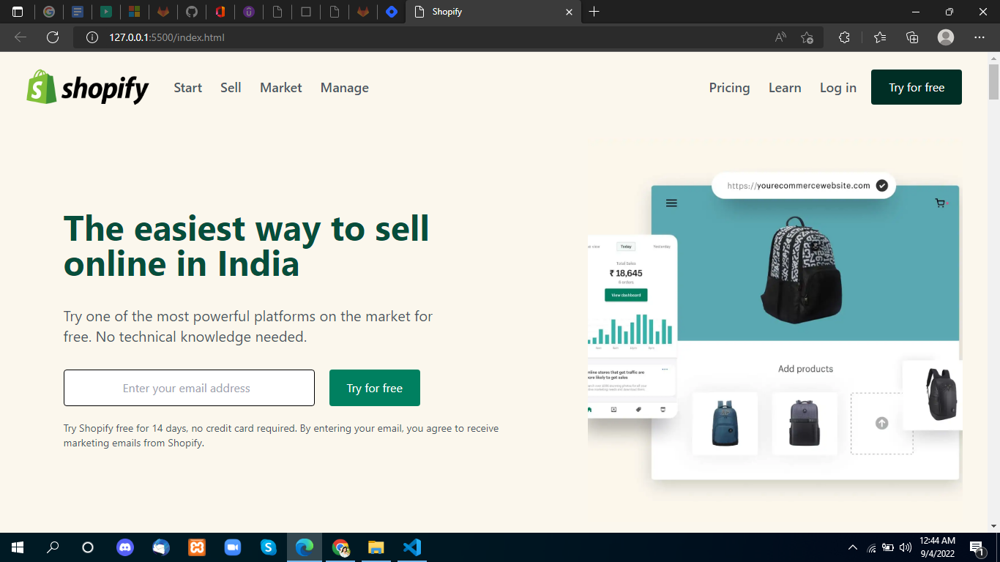
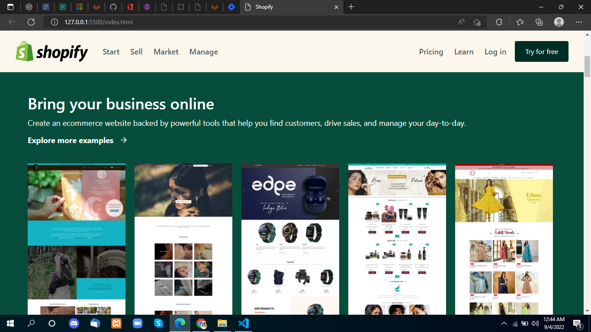
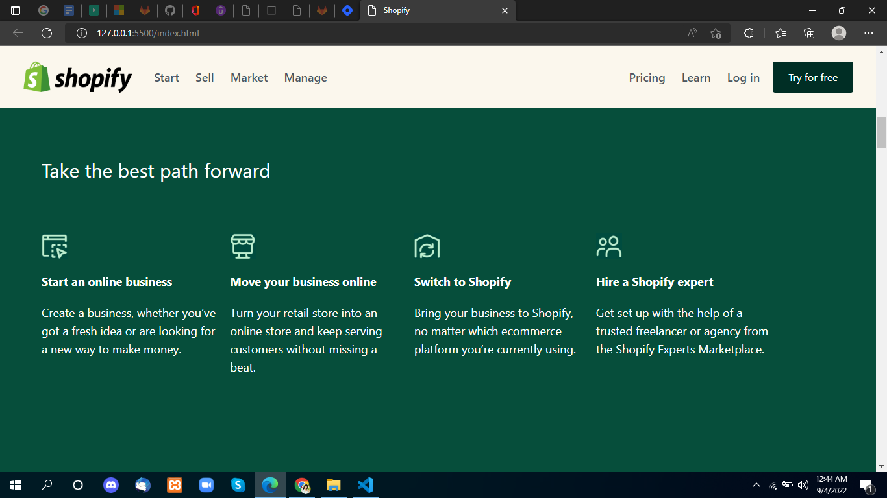
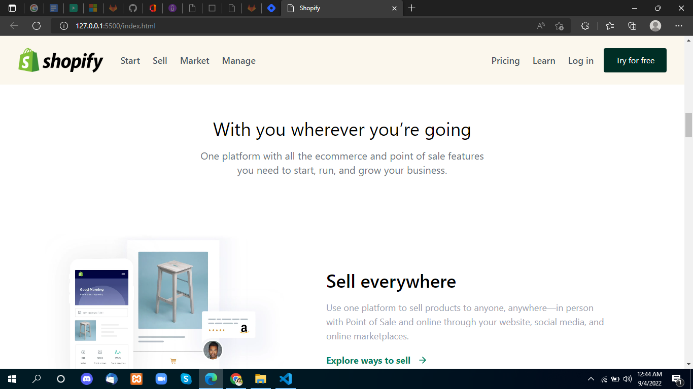
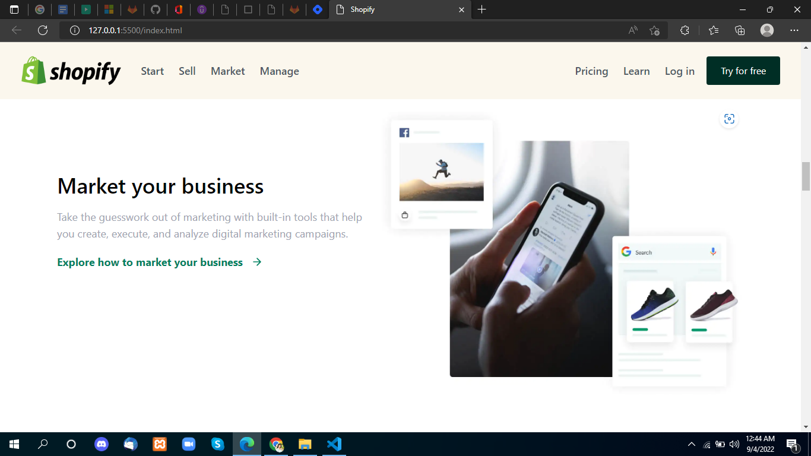
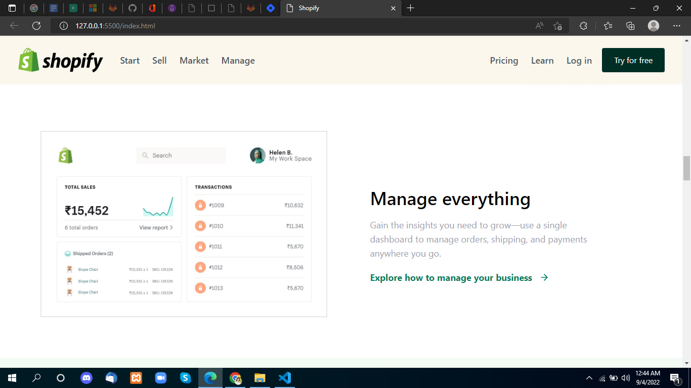
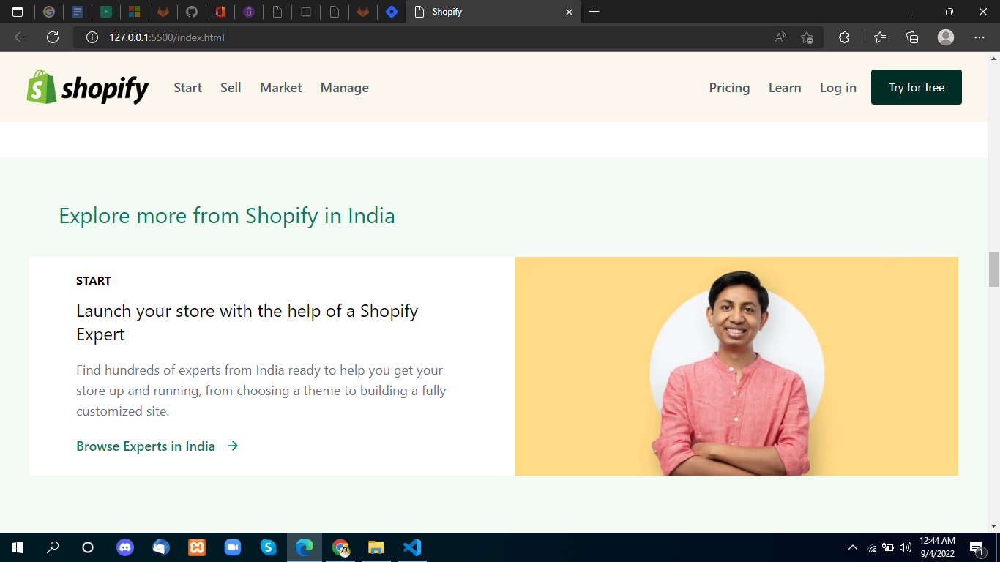
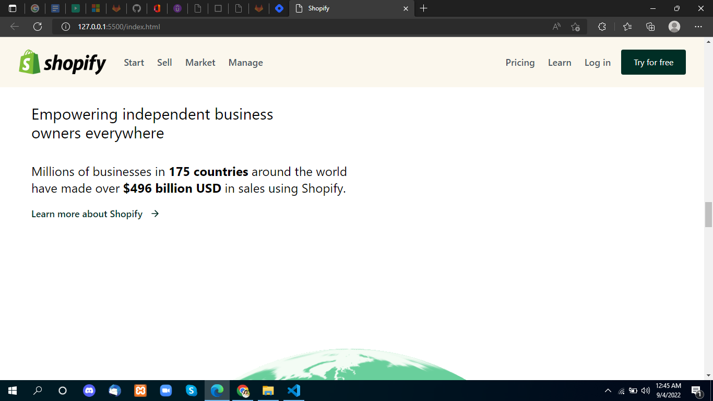
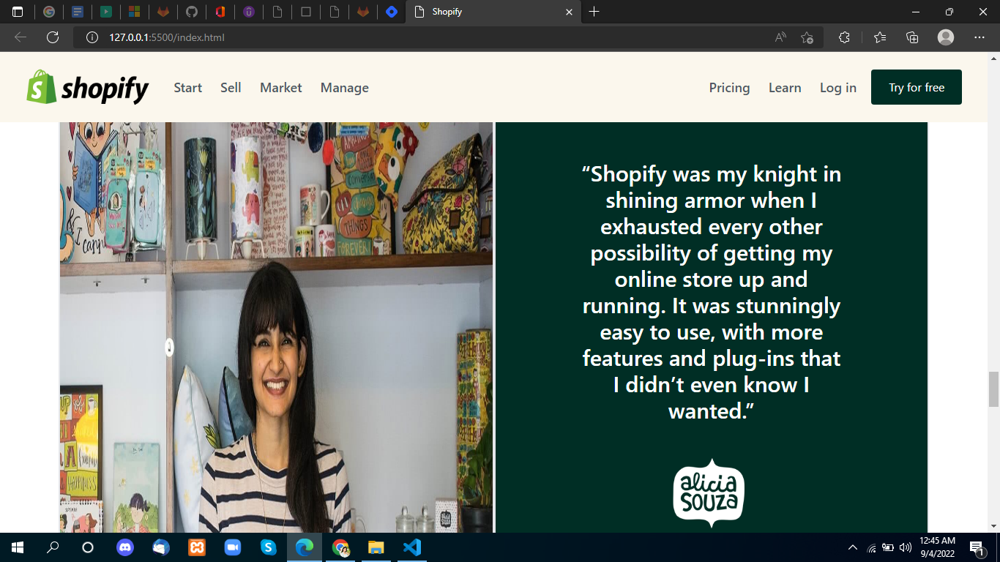
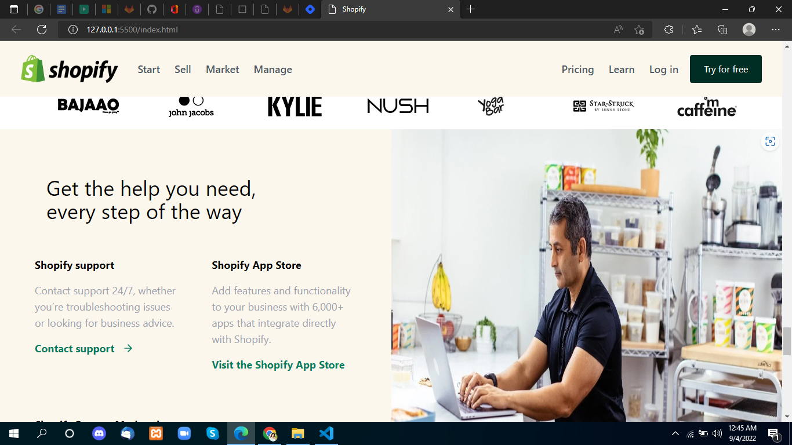
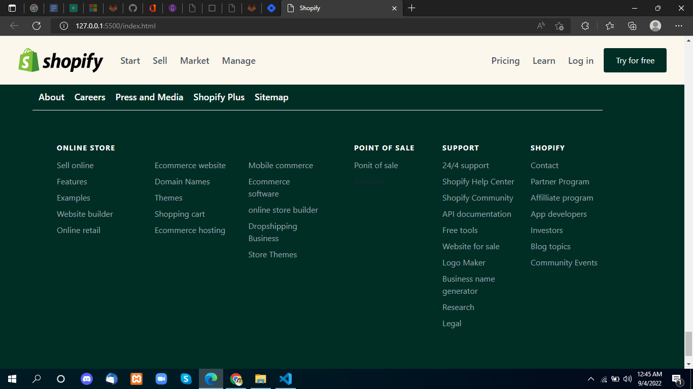

 

## project Type
- Shopify Clone- multiple components. 
- UI Design with mobile responsive.

## My learning from this Project
- Tailwind classes
- Tailwind class properties nav sticky 
- flex-box in tailwind
- grid in tailwind
- Imges Properties 
- Responsive Classes
- Colors and tailwind config theme
- Lots of small things I learn from making this project in tailwind

## Time to make this project
#### Approx 9-10 hour to make
